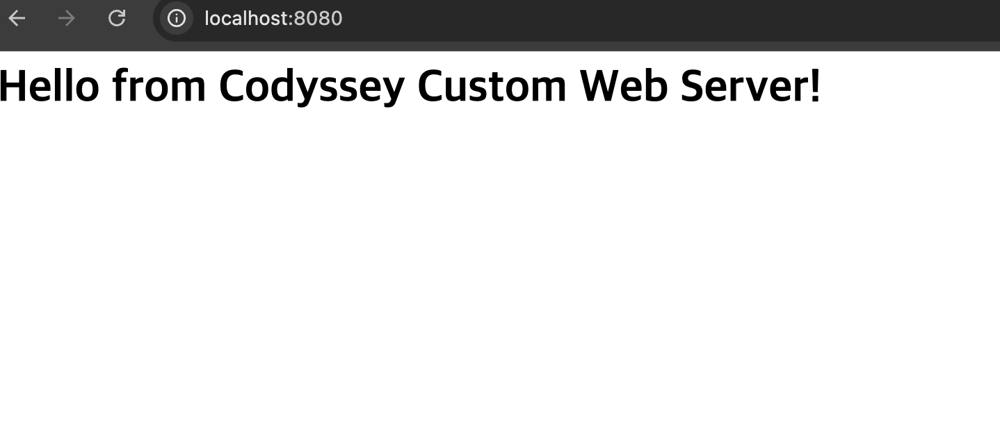

# 개발 워크스테이션 구축 (Codyssey Mission 01)

## 1. 프로젝트 개요 및 구조
본 프로젝트는 코드가 "내 컴퓨터에서만" 돌아가는 문제를 방지하고, 팀원 누구나 동일하게 실행·배포할 수 있는 재현 가능한 환경 구성을 목표로 합니다. 서울캠퍼스 시스템 보안 정책에 따라 **OrbStack**을 활용해 `sudo` 권한 없이 컨테이너 환경을 구축했으며, **리눅스 CLI**, **Docker**, **Git/GitHub**를 직접 세팅하고 원리를 검증하였습니다.

### 1.1 디렉토리 구조 및 역할
```text
codyssey_mission01/
├── README.md       # 전체 환경 세팅의 명세, 이론적 배경, 실행 로그를 담은 기술 문서
├── app/
│   └── index.html  # 커스텀 NGINX 웹 서버에 띄울 정적 웹 페이지 소스코드
└── Dockerfile      # NGINX 알파인 베이스의 웹 서버 컨테이너 빌드 명세서

```

### 1.2 재현 가이드 (Reproduction Guide)

1. 저장소 Clone 후 디렉토리 진입 (`git clone ... && cd codyssey_mission01`)
2. 커스텀 웹 서버 이미지 빌드: `docker build -t my-custom-web:1.0 .`
3. 포트 매핑으로 컨테이너 실행: `docker run -d -p 8080:80 --name web-8080 my-custom-web:1.0`
4. 접속 확인: `curl http://localhost:8080` (또는 브라우저 `http://localhost:8080` 접속)

---

## 2. 핵심 이론 요약

### 2.1 절대경로 vs 상대경로 사용 기준

* **상대경로 (`./app/index.html`)**: 현재 작업 디렉토리 기준 경로입니다. 소스코드 관리 시 프로젝트 루트가 이동해도 유연하게 대응할 수 있어 로컬 개발 및 Dockerfile의 `COPY` 명령 등에 주로 사용합니다.
* **절대경로 (`/usr/share/nginx/html/index.html`)**: 시스템 루트(`/`)부터의 전체 경로입니다. 컨테이너 내부처럼 파일 시스템 구조가 고정되어 있어 위치가 변하지 않는 명확한 대상을 지정할 때 사용합니다.

### 2.2 권한(Permission) 비트 표기법과 의미

리눅스 권한은 소유자(User), 그룹(Group), 기타(Others)에 대해 읽기(4), 쓰기(2), 실행(1)의 합으로 계산됩니다.

| 표기 | 권한 내용 | 의미 및 적용 대상 |
| --- | --- | --- |
| **644** | `rw-r--r--` | 소유자는 읽기/쓰기, 그룹/기타는 읽기만 가능 (**일반 파일** 기본값) |
| **755** | `rwxr-xr-x` | 소유자는 읽기/쓰기/실행, 그룹/기타는 읽기/실행 가능 (**디렉토리/실행 파일** 기본값) |

### 2.3 이미지(Image)와 컨테이너(Container)의 개념

* **이미지**: 애플리케이션 실행에 필요한 파일과 설정이 포함된 **불변(Immutable)의 템플릿**입니다.
* **컨테이너**: 이미지를 기반으로 실행되어 메모리상에서 동작하는 **격리된 프로세스**입니다. 쓰기 레이어가 추가되어 내부 상태가 변할 수 있습니다.

### 2.4 포트 매핑(-p)과 네트워크 네임스페이스

Docker 컨테이너는 호스트와 격리된 자체 네트워크 네임스페이스를 가집니다. 외부 사용자가 호스트(예: `8080` 포트)로 보낸 트래픽을 컨테이너 내부 서비스(예: `80` 포트)로 안전하게 전달(포워딩)하기 위해 **포트 매핑**이 필수적이며, 이를 통해 불필요한 포트 노출을 통제합니다.

---

## 3. 수행 로그 및 검증 결과

### 3.1 터미널 조작 (생성·복사·이동·삭제) 및 권한 실습

```bash
# 디렉토리 생성 및 이동
$mkdir mission_practice$ cd mission_practice

# 파일 생성 및 쓰기
$ echo "Terminal practice" > sample.txt

# 파일 복사, 이동(이름 변경), 삭제(rm) 증거
$ cp sample.txt copy.txt
$ mv copy.txt rename.txt
$ rm rename.txt
$ ls -la
drwxr-xr-x  3 user  user   96  8 14 15:34 .
drwxr-xr-x  5 user  user  160  8 14 15:34 ..
-rw-r--r--  1 user  user   18  8 14 15:34 sample.txt

# 권한 실습 (644 / 755 적용)
$ chmod 644 sample.txt
$ cd ..
$chmod 755 mission_practice$ ls -l mission_practice/sample.txt
-rw-r--r--  1 user  user  18  8 14 15:34 mission_practice/sample.txt

```

### 4.2 Docker 설치 및 데몬 점검

```bash
$ docker --version
Docker version 29.4.0, build 9d7ad9f

$ docker info
Client:
  Version:    29.4.0
  Context:    orbstack
Server:
  Containers: 2
  Running: 1
  Images: 3
  Server Version: 29.4.0
  Storage Driver: overlayfs
  Operating System: OrbStack
  Architecture: x86_64

```

### 3.3 Docker 기본 운영 및 컨테이너 라이프사이클 검증

```bash
# hello-world 실행 결과 (전체 출력 증거)
$ docker run hello-world
Hello from Docker!
This message shows that your installation appears to be working correctly.
...

# 컨테이너 상태(ps -a) 및 이미지 목록(images) 확인
$ docker ps -a
CONTAINER ID   IMAGE               COMMAND                  CREATED         STATUS                     PORTS                     NAMES
d4551822588d   hello-world         "/hello"                 10 mins ago     Exited (0) 10 mins ago                               epic_pasteur
63cfaed61344   my-custom-web:1.0   "/docker-entrypoint.…"   41 mins ago     Up 41 mins                 0.0.0.0:8080->80/tcp      web-8080

$ docker images
REPOSITORY          TAG       ID             DISK USAGE
hello-world         latest    5dd0d3e6e255   21.8kB
my-custom-web:1.0   d6b5a4259f0e   93.9MB
ubuntu:latest       678c6550cc43   158MB

# exit vs exec 차이 검증 실습
$ docker run -it --name my-ubuntu ubuntu bash
root@...:/# exit  # 컨테이너 종료 (Exited 상태)

$docker run -d --name keep-ubuntu ubuntu sleep infinity$ docker exec -it keep-ubuntu bash
root@...:/# exit  # 접속만 해제, 컨테이너 유지 (Up 상태)

$ docker rm -f my-ubuntu keep-ubuntu

```

### 3.4 커스텀 이미지 빌드 및 포트 매핑 접속 증거

* **Dockerfile 내용:**

```dockerfile
FROM nginx:alpine
COPY app/index.html /usr/share/nginx/html/index.html

```

* **수행 로그 및 curl 접속 증거:**

```bash
$ docker build -t my-custom-web:1.0 .
$docker run -d -p 8080:80 --name web-8080 my-custom-web:1.0$ curl http://localhost:8080
<h1>Hello from Codyssey Custom Web Server!</h1>

```

* **브라우저 접속 화면:**
*(브라우저 주소창에 `http://localhost:8080` 입력 시 `Hello from Codyssey Custom Web Server!` 정상 출력 확인)*
* **브라우저 접속 화면:**


### 3.5 데이터 영속성(Volume) 및 백업 전략

* **백업 전략 안내:** 실무에서는 Docker 볼륨 데이터를 주기적으로 `tar` 명령어로 압축하여 외부 스토리지에 아카이빙하는 방식을 사용합니다.
* **영속성 검증 수행 로그:**

```bash
$ docker volume create my_data_vol
$docker run -d --name vol-test2 -v my_data_vol:/data ubuntu sleep infinity$ docker exec -it vol-test2 bash -lc "echo 'Codyssey volume test' > /data/test.txt"

# 볼륨 내부 파일 목록 확인 (ls -la)
$ docker exec -it vol-test2 ls -la /data
total 4
drwxr-xr-x 1 root root 16 Aug 14 09:12 .
drwxr-xr-x 1 root root 14 Aug 14 09:12 ..
-rw-r--r-- 1 root root 21 Aug 14 09:12 test.txt

# 파일 내용 확인 및 영속성 검증 후 정리
$ docker exec -it vol-test2 cat /data/test.txt
Codyssey volume test
$docker rm -f vol-test2$ docker volume rm my_data_vol

```

### 3.6 Git 설정 및 원격 저장소 푸시 로그

```bash
$ git remote -v
origin  [https://github.com/yujinchoe/codyssey_mission01.git](https://github.com/yujinchoe/codyssey_mission01.git) (fetch)
origin  [https://github.com/yujinchoe/codyssey_mission01.git](https://github.com/yujinchoe/codyssey_mission01.git) (push)

$ git push origin main
Everything up-to-date (또는 Writing objects: 100%, done.)

```

---

## 4. 트러블슈팅

### 4.1 zsh 특수문자 파싱 에러

* **현상:** `echo "<h1>..."` 명령 실행 시 `zsh: event not found` 에러 발생.
* **원인 가설:** zsh 셸이 HTML 태그나 느낌표를 히스토리 확장 기호로 오인함.
* **해결 방법:** `cat << 'EOF'` 다중 행 입력 구문을 사용하여 특수문자 간섭 없이 안전하게 파일을 생성함.

### 4.2 GitHub 푸시 인증 거부

* **현상:** 원격 저장소 푸시 시 비밀번호 인증 방식 거부 에러 발생.
* **원인 가설:** GitHub 보안 정책 변경으로 일반 비밀번호 대신 토큰(PAT) 인증이 필수화됨.
* **해결 방법:** GitHub에서 Personal Access Token을 발급받아 키체인에 등록 및 적용 완료.

### 4.3 포트 충돌 진단 및 대처 절차

* **진단 절차:** 만약 `8080` 포트 사용 중 충돌 발생 시 아래 순서로 대처합니다.
1. 포트 점유 프로세스 확인: `lsof -i :8080` (또는 `netstat -an | grep 8080`)
2. 프로세스 종료 또는 기존 컨테이너 중지: `docker stop web-8080` 혹은 `kill -9 [PID]`
3. 포트 변경 실행 대안: `docker run -d -p 8081:80 ...`처럼 호스트 포트를 다르게 지정하여 우회.